# Magic ePaper


**Magically Create and Transfer Content to NFC ePaper Badges**

The Magic ePaper app is an open-source Flutter application that lets users design and transfer content to a tri-color, battery-free NFC ePaper badge. The app features an intuitive UI with drawing tools, text input, emoji support, font customization, and image editing (rotation, brightness, contrast, filters optimized for ePaper such as Floyd–Steinberg and Atkinson dithers). It supports NFC-based reading/writing of images and advanced NDEF data (text, URLs, vCards, app launch). A built-in Image Library stores processed images for quick transfers. Additional tools include QR/barcode generation, employee ID, and price tag creation.

## Download

* [Latest Release Build](https://github.com/fossasia/magic-epaper-app/tree/app) in the app branch

## Permissions
* **NFC**: For reading and writing data to the ePaper badge via NFC.
* **Internet**: For network operations and updates.

## Translations

Translators can support the project on Weblate here: https://hosted.weblate.org/projects/fossasia/magic-epaper-app/

## Screenshots

<table>
  <tr>
    <td></td>
    <td>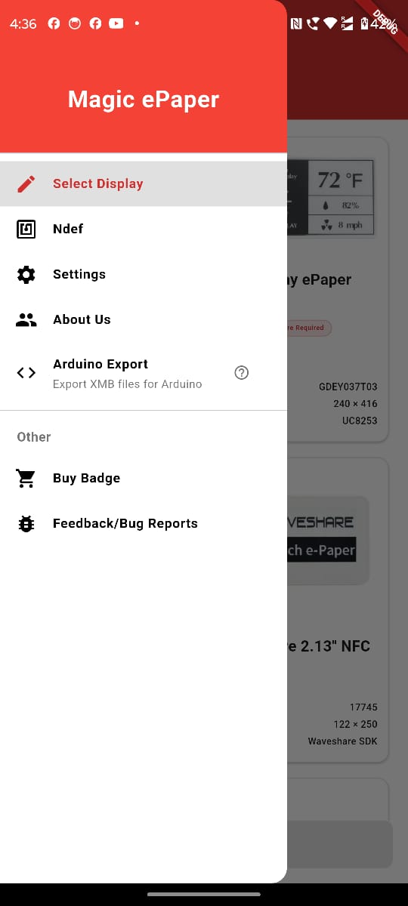</td>
    <td>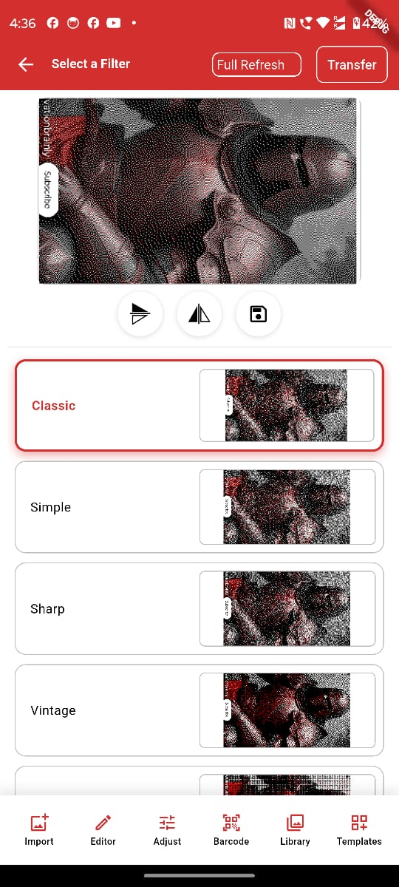</td>
  </tr>
  <tr>
    <td>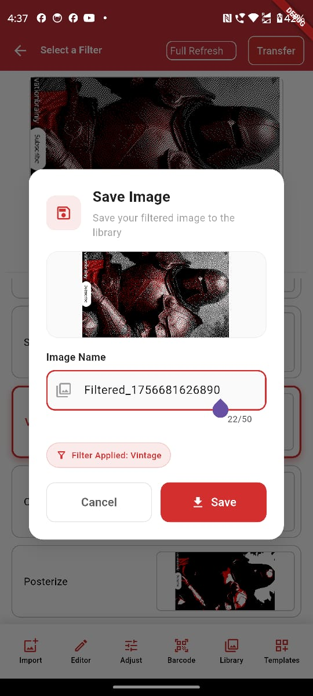</td>
    <td></td>
    <td></td>
  </tr>
  <tr>
    <td></td>
    <td></td>
    <td>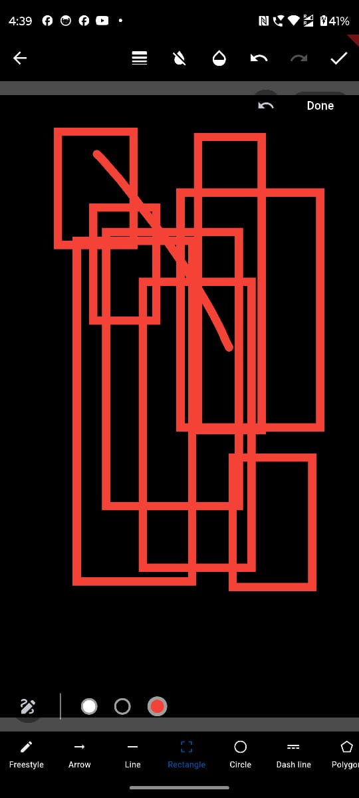</td>
  </tr>
  <tr>
    <td>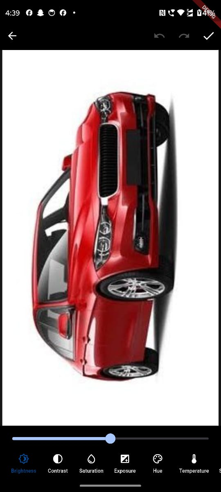</td>
    <td></td>
    <td>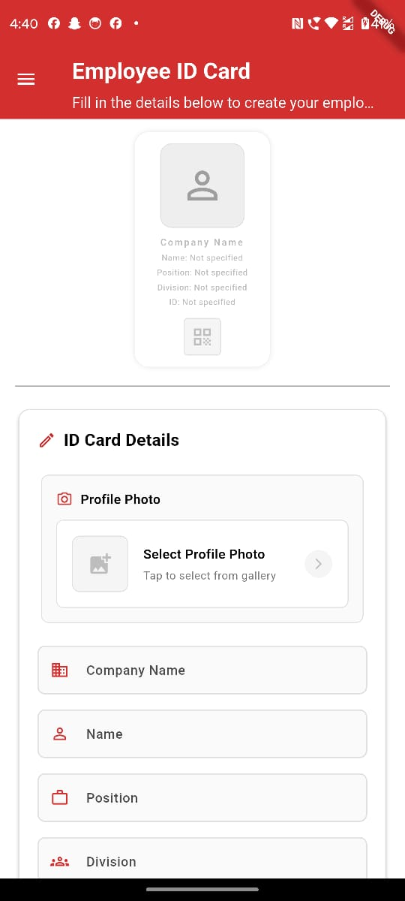</td>
  </tr>
  <tr>
    <td>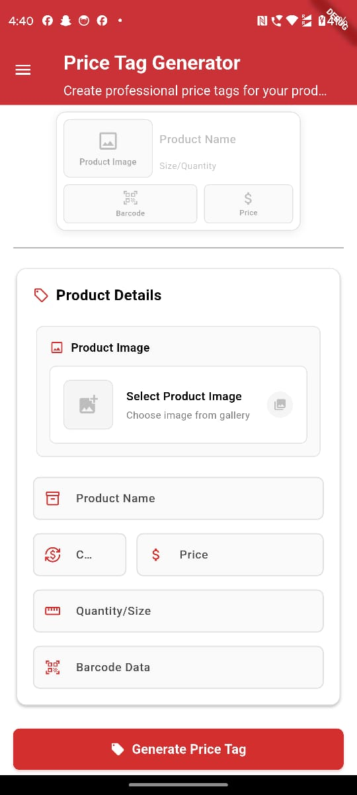</td>
    <td>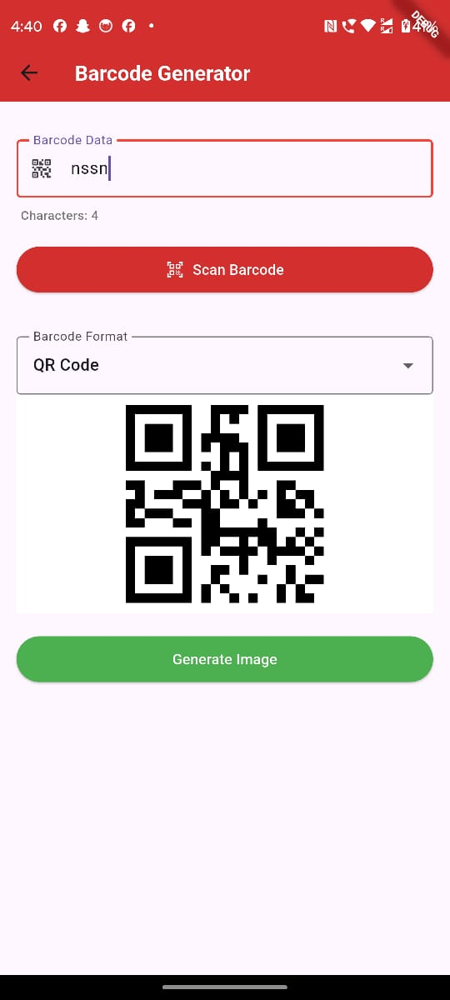</td>
    <td>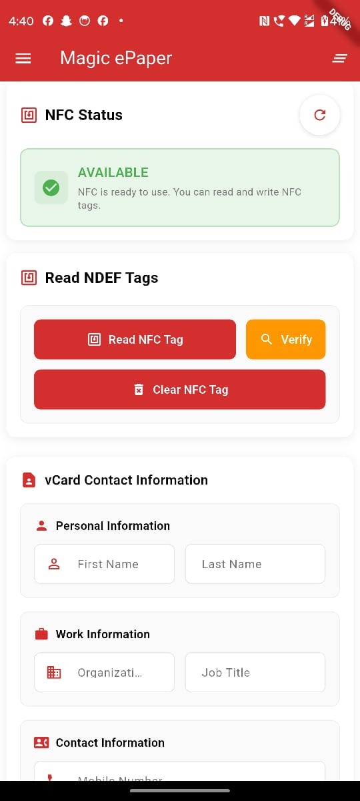</td>
  </tr>
  <tr>
    <td></td>
    <td>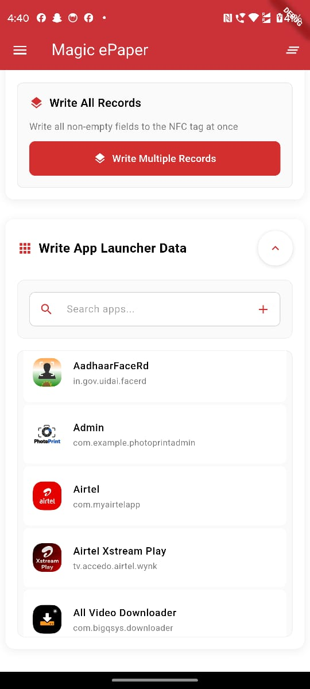</td>
    <td>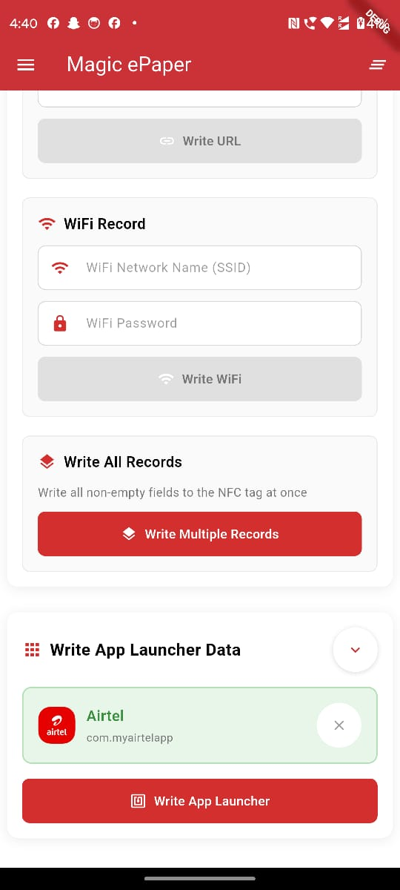</td>
  </tr>
  <tr>
    <td colspan="3">
      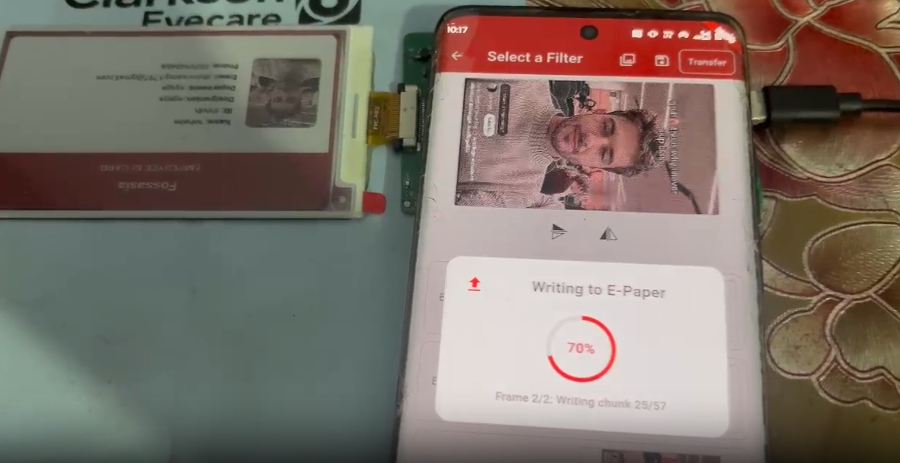
    </td>
  </tr>
</table>

## Branch Policy

We have the following branches

 * **main**: All development goes on in this branch. If you're making a contribution, you are supposed to make a pull request to _main_. PRs to main branch must pass a build check on CI/CD.
 * **app**: This branch contains the latest app builds and releases.
 * **version**: This branch stores the version information for the app builds (versionName and versionCode). This is used in our workflows for automatic versioning wherein the next version information is automatically fetched from this branch and used for building the app.
 * **fastlane-android**: This branch contains information and metadata used by fastlane to automate Android deployment.
 * **pr-screenshots**: This branch stores screenshots for every open pull request, which are shown in comments in every pull request.

## Contributions Best Practices

Please read FOSSASIA's [Best Practices](https://blog.fossasia.org/open-source-developer-guide-and-best-practices-at-fossasia/) before contributing. Please help us follow the best practice to make it easy for the reviewer as well as the contributor. We want to focus on the code quality more than on managing pull request ethics. Here are some basics:

* Single commit per pull request
* For writing commit messages please read the [CommitStyle.md](docs/commitStyle.md).
* Follow uniform design practices. The design language must be consistent throughout the app.
* The pull request will not get merged until and unless the commits are squashed. In case there are multiple commits on the PR, the commit author needs to squash them and not the maintainers cherrypicking and merging squashes.
* If the PR is related to any front end change, please attach relevant screenshots in the pull request description.
* Before you join development, please set up the project on your local machine, run it and go through the application completely. Press on any button you can find and see where it leads to. Explore.
* If you would like to work on an issue, drop in a comment at the issue. If it is already assigned to someone, but there is no sign of any work being done, please free to drop in a comment and start working on it.

## Dev Container usage

Opening this repository in VSCode, GitHub Codespaces or another supported editor/IDE will allow the repository to be opened in a [Dev Container](https://containers.dev/).

The Dev Container contains all necessary dependencies and tools required to build, run and debug flutter applications.

### How to connect via `adb`

:warning: In case `adb` is already installed and running on the host it may need to be stopped before continuing.

This Dev Container allows several different methods of connecting to a device via `adb`:

#### Entirely from inside the container (USB pass-through)

:information_source: **Windows** and **MacOS** need a working **USB/IP** setup. Read more in the official [Docker Desktop documentation](https://docs.docker.com/desktop/features/usbip/) and in this [blog post](https://blog.golioth.io/usb-docker-windows-macos/).

The Dev Container bind-mounts `/dev/bus/usb/` and sets the correct access controls for a seamless integration.  \
Enable [USB debugging](https://developer.android.com/tools/adb#Enabling) on your phone and try to find it via:

```bash
adb devices
```
If it shows up, everything is ready and you can run `flutter run` to push a development version of the app onto your device.

#### Using the host's `adb` server

If `adb` is already installed on the host, the tools in the Dev Container can be configured to use the host's `adb` server:

1. Ensure the `adb` server is listening on **all interfaces**
    1. If that is not the case, kill and restart it: `adb kill-server && adb -a server` (the `-a` instructs it to listen on all interfaces).
1. Set or export the following environment variable before executing `adb` or `flutter run`: `ADB_SERVER_SOCKET=tcp:host.docker.internal:5037`
1. You should now be able to list the devices connected via USB to the host

#### Wireless connection

Android 11 and higher support wireless debugging. Check out the [documentation](https://developer.android.com/tools/adb#wireless-android11-command-line) for more information.  \
For this mode it is required that both the workstation and the device are on the **same network**.

:information_source: This also works when developing inside **GitHub Codespaces**. In that case you can bring your device and the Codespace onto the same network by installing WireGuard, Tailscale or another overlay/mesh network on both the Codespace and your device.

Enable Wireless debugging as per the [documentation](https://developer.android.com/tools/adb#wireless-android11-command-line), then **pair** `adb pair <IP>:<PORT>` and **connect** `adb connect <IP>:<PORT>` and you should be able to find your device via `adb devices`.

## Table of Contents
- [Getting Started](#getting-started)
- [Assets](#assets)
- [Localization](#localization)
- [Installation Steps](#installation-steps)
  - [Prerequisites](#prerequisites)
  - [Clone the Repository](#clone-the-repository)
  - [Install Dependencies](#install-dependencies)
- [Running the Project](#running-the-project)

## Getting Started

This project is a starting point for a Flutter application that follows the
[simple app state management
tutorial](https://flutter.dev/to/state-management-sample).

For help getting started with Flutter development, view the
[online documentation](https://docs.flutter.dev), which offers tutorials,
samples, guidance on mobile development, and a full API reference.

## Assets

The `assets` directory houses images, fonts, and any other files you want to
include with your application.

The `assets/images` directory contains [resolution-aware
images](https://flutter.dev/to/resolution-aware-images).

## Localization

This project generates localized messages based on arb files found in
the `lib/src/localization` directory.

To support additional languages, please visit the tutorial on
[Internationalizing Flutter apps](https://flutter.dev/to/internationalization).

## Installation Steps

### Prerequisites

##### Before setting up the project, ensure you have the following installed:

Flutter SDK: Install from Flutter's official website.

Dart SDK: Included with Flutter, but verify installation using `dart --version`

Git: Required for cloning the repository. Install from Git's official site.

Android Studio or VS Code: Recommended IDEs for Flutter development.

Android Emulator or Physical Device: For running the application.

1. Clone the Repository
```
git clone https://github.com/fossasia/magic-epaper-app
cd magic-epaper-app
```

2. Install Dependencies
```
flutter pub get
```

## Running the Project

1. Run on an Emulator or Physical Device

Ensure an emulator is running or a device is connected.

Execute:
```
flutter run
```
2. Build the App (For production/testing)
```
flutter build apk  # For Android
flutter build ios  # For iOS (macOS required)
```

## LICENSE

The application is licensed under the [Apache License 2.0](/LICENSE). Copyright is owned by FOSSASIA and its contributors.
